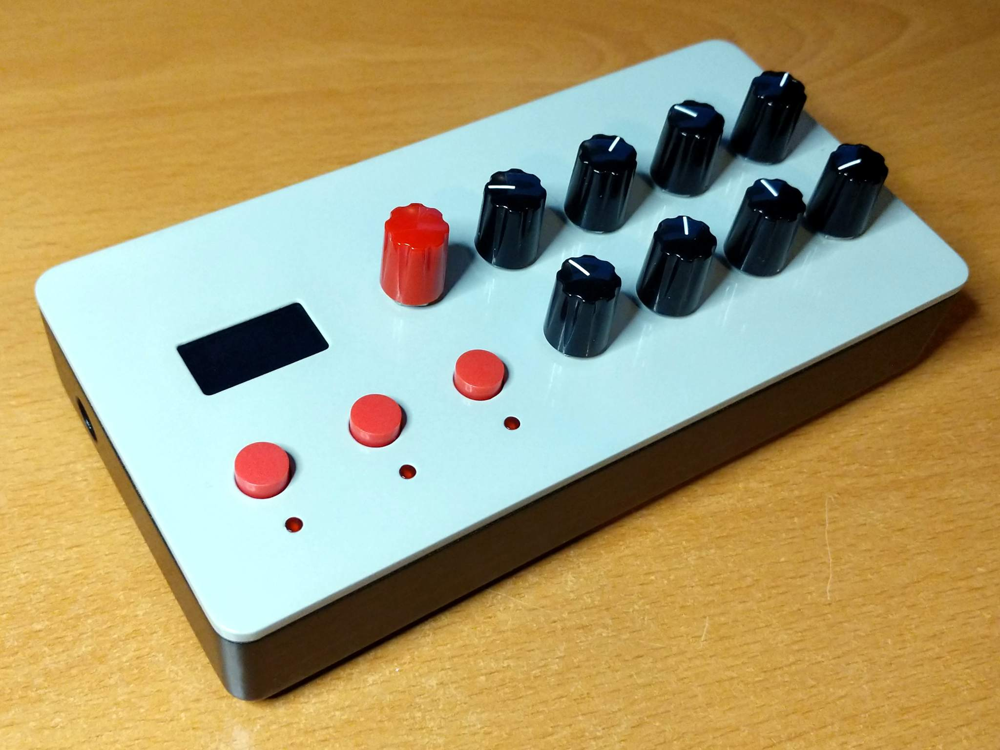

# Axoloti control board

A control board for the [Axoloti Core](http://www.axoloti.com/) board.

Inspired by [Tom Whitwell's Axo
Control](https://github.com/TomWhitwell/Axo-Control), but adds a rotary encoder
and an I2C OLED screen and removes the joystick.

## Features:

- 8 potentiometers
- Rotary encoder with switch
- 3 push buttons
- 3 LEDs (below buttons)
- OLED screen

## Bill of materials

| Qty | Ref | Part | Notes  |
| --- | --- | ---- | ------ |
|   8 | RV1-8 | 9mm potentiometer B10k | [Thonk](https://www.thonk.co.uk/shop/alpha-9mm-pots-dshaft/) |
|   3 | SW1-3 | C&K tactile switch | [Thonk](https://www.thonk.co.uk/shop/radio-music-switch/) |
|   1 | SW4 | Encoder with switch | [Bourns PEC11R-4220F-S0024](https://www.mouser.co.uk/ProductDetail/Bourns/PEC11R-4220F-S0024) matches the above potentiometers in height |
|  10 | C1-9 | Capacitor 0603 100n | Might not be needed, can also try 10n for C9 and C10 |
|   3 | R1-3 | Resistor 0603 1k | |
|   2 | R5, R6 | Resistor 0603 10k | |
|   3 | D1-3 | 3mm LED | |
|   1 | | 0.96" White I2C SSD1306 OLED | Pin order VCC GND SCL SDA, e.g. [Banggood](https://uk.banggood.com/5Pcs-0_96-Inch-4Pin-White-IIC-I2C-OLED-Display-Module-12864-LED-p-971295.html) |
|   1 | | 1×40 2.54mm header | |
|   1 | | 1×40 2.54mm socket | |
|   1 | | 1900H knob without line | [Thonk](https://www.thonk.co.uk/shop/1900h-d/) |
|   8 | | 1900H knob with line | [Thonk](https://www.thonk.co.uk/shop/1900h-d/) |
|   8 | | 1.4mm dia × 4mm screw for plastic | For mounting screen: [Bitsbox](https://www.bitsboxuk.com/index.php?main_page=product_info&cPath=238_241&products_id=3443) |
|   6 | | M3 × 8mm screw | |
|   6 | | M3 × 11mm threaded standoff | |

## Hardware

OpenSCAD files for hardware are provided:

- axo-base.scad: lower part of enclosure
- axo-top.scad: upper part of enclosure
- ssd1306-riser.scad: riser for the display to bring it to the same height as
  the controls, so that it sits just below the front panel

## Connections

    OLED       ENC      RV1  RV2  RV3  RV4
    SDA PB9    SW PB6   PC3  PC4  PA0  PB1
    SCL PB8    A  PB7
               B  PC0

    SW1   SW2   SW3     RV5  RV6  RV7  RV8
    PC1   PC2   PC5     PA4  PA6  PA7  PB0

    LED1  LED2  LED3
    PA1   PA2   PA3

## Reuse

 This work is licensed under a <a rel="license" href="http://creativecommons.org/licenses/by-sa/4.0/">Creative Commons Attribution-ShareAlike 4.0 International License</a>.
